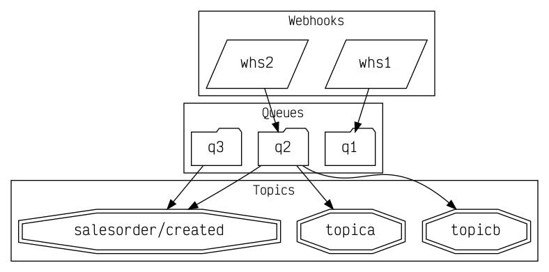

# Generating artifact graphs

This directory holds content relating to the [Graphing SAP Enterprise Messaging Artifacts](https://www.youtube.com/playlist?list=PL6RpkC85SLQB9d462qCFLv2BW4o37ZaIC) Hands-on SAP Dev miniseries. The miniseries is about visualizing SAP Enterprise Messaging artifacts (topics, queues, webhooks and subscriptions) using Graphviz and a bit of shell scripting.

## Tools

Beyond what's been described already in the main [README](../README.md) file for this repository, here's a list of tools used in this miniseries:

- [Graphviz](https://graphviz.org/) - Graph visualization software; this includes the utilities such as `dot` that we use to process [dot language](https://graphviz.org/doc/info/lang.html) files and produce graph output

- [entr](https://github.com/eradman/entr) - Event Notify Test Runner; this is a very useful utility (similar in some ways to `nodemon`, but more generic) that we use to automatically re-process dot language files when they change

- [Tab Reloader](https://chrome.google.com/webstore/detail/tab-reloader-page-auto-re/dejobinhdiimklegodgbmbifijpppopn) Chrome extension; we used this in [Part 1](https://www.youtube.com/watch?v=E9Ha0tnXGS4) of the miniseries to auto-refresh the graph image we were generating

## Progress

In [Part 1](https://www.youtube.com/watch?v=E9Ha0tnXGS4) we manually created the [test.dot](test.dot) file contents (starting out from one of the [examples](https://graphs.grevian.org/)), intending to work out how to represent the artifacts in the instance of our Enterprise Messaging service running on SAP Cloud Platform. Using the Graphviz `dot` utility we generated a PNG representation of the graph in [test.png](test.png):

We wrapped the call to `dot` in a shell script [godot](godot), for two reasons:
- to be able to call it easily from the context of `entr`
- to explore the various [node, edge and graph attributes](https://graphviz.org/doc/info/attrs.html) available to us, via `-N` and `-G` switches, initially.

